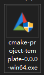
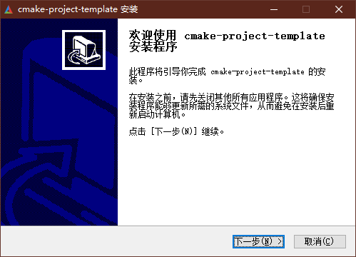

# CMake Project Template

这是为跨平台 C++ 项目设计的 CMake 模板仓库，易于上手。

目前此项目仍处于开发阶段。

## 1. 主要功能

- [x] GitHub Action 自动化构建
- [x] Ubuntu / Windows C++ 项目编译
- [x] 测试框架支持
    - [x] Catch2
    - [ ] GTest 【计划中】
- [ ] Qt 项目支持 【计划中】
- [x] Windows INSTALL 打包
- [x] Ubuntu DEB 打包

## 2. 如何使用

你可以按照以下步骤来使用此模板：

1. [创建](#21-创建仓库)你的仓库
2. 了解[项目结构](#22-项目结构)
3. 编写、[编译](#23-项目编译)你的项目代码
4. 编写测试代码[执行测试](#24-项目测试)
5. [打包](#25-项目打包)可执行文件
6. GitHub [自动化构建](#26-自动化构建)


### 2.1 创建仓库

点击 [Use this template](https://github.com/Ohto-Ai/CMakeProjectTemplate/generate) 生成自己的项目。

### 2.2 项目结构

cmake 目录存放构建工具使用的 cmake 脚本。  
doc 目录存放项目文档。  
inc 为项目共用的包含目录。  
lib 为项目共用的库目录。  
src 为项目主要代码目录。  
test 存放测试代码。

```
.
├── cmake
│   ├── package.cmake
│   └── version_from_git_tag.cmake
├── CMakeLists.txt
├── doc
│   └── img
│       ├── package_windows_finish.png
│       ├── package_windows_installing.png
│       ├── package_windows_install_options.png
│       ├── package_windows_install_path.png
│       ├── package_windows_license.png
│       ├── package_windows_start_menu.png
│       ├── package_windows_thumb.png
│       └── package_windows_welcome.png
├── inc
│   └── catch2
│       └── catch.hpp
├── lib
├── LICENSE
├── README.md
├── src
│   ├── CMakeLists.txt
│   ├── inc
│   │   └── version.h.in
│   ├── main.cpp
│   └── res
│       └── icon.ico
└── test
    ├── CMakeLists.txt
    └── version.test.cpp
```

### 2.3 项目编译

使用以下命令编译示例代码
```bash
cmake -Bbuild -DCMAKE_BUILD_TYPE=Debug
cmake --build build --config Debug --target install -j8
```

这是一个编译示例：

```log
@ohto-ai ➜ /workspaces/CMakeProjectTemplate (10-request-update-readme) $ cmake -Bbuild -DCMAKE_BUILD_TYPE=Debug
-- The C compiler identification is GNU 9.4.0
-- The CXX compiler identification is GNU 9.4.0
-- Detecting C compiler ABI info
-- Detecting C compiler ABI info - done
-- Check for working C compiler: /usr/bin/cc - skipped
-- Detecting C compile features
-- Detecting C compile features - done
-- Detecting CXX compiler ABI info
-- Detecting CXX compiler ABI info - done
-- Check for working CXX compiler: /usr/bin/c++ - skipped
-- Detecting CXX compile features
-- Detecting CXX compile features - done
-- Performing Test CMAKE_HAVE_LIBC_PTHREAD
-- Performing Test CMAKE_HAVE_LIBC_PTHREAD - Failed
-- Looking for pthread_create in pthreads
-- Looking for pthread_create in pthreads - not found
-- Looking for pthread_create in pthread
-- Looking for pthread_create in pthread - found
-- Found Threads: TRUE  
-- GIT_REFSPEC  refs/heads/10-request-update-readme
-- GIT_SHA1     02fd072f6668ec79b1bc3381e8fb362668a5a8f3
-- GIT_DESCRIBE v0.0.1-1-g02fd072
-- Configuring done (4.1s)
-- Generating done (0.0s)
-- Build files have been written to: /workspaces/CMakeProjectTemplate/build
@ohto-ai ➜ /workspaces/CMakeProjectTemplate (10-request-update-readme) $ cmake --build build --config Debug --target install -j8
[ 25%] Building CXX object src/CMakeFiles/CMakeProjectTemplate.dir/main.cpp.o
[ 50%] Building CXX object test/CMakeFiles/version.test.dir/version.test.cpp.o
[ 75%] Linking CXX executable CMakeProjectTemplate
[ 75%] Built target CMakeProjectTemplate
[100%] Linking CXX executable version.test
[100%] Built target version.test
Install the project...
-- Install configuration: "Debug"
-- Installing: /workspaces/CMakeProjectTemplate/bin/CMakeProjectTemplate
-- Up-to-date: /workspaces/CMakeProjectTemplate/bin/CMakeProjectTemplate
@ohto-ai ➜ /workspaces/CMakeProjectTemplate (10-request-update-readme) $
```

你应当在 bin/ 目录看到示例代码编译出的二进制可执行文件 `cmake-project-template`。

### 2.4 项目测试

当构建项目代码时，测试代码也应当会一并被构建。

在 build/test/ 目录中，你可以执行这些程序查看测试结果，也可以使用`ctest`来执行所有的测试程序。

以下是一个示例：
```log
@ohto-ai ➜ /workspaces/CMakeProjectTemplate (10-request-update-readme) $ ctest --build-config Debug --test-dir build/test --output-on-failure
Internal ctest changing into directory: /workspaces/CMakeProjectTemplate/build/test
Test project /workspaces/CMakeProjectTemplate/build/test
    Start 1: version.test
1/1 Test #1: version.test .....................   Passed    0.04 sec

100% tests passed, 0 tests failed out of 1

Total Test time (real) =   0.06 sec
@ohto-ai ➜ /workspaces/CMakeProjectTemplate (10-request-update-readme) $ ./build/test/version.test -s

~~~~~~~~~~~~~~~~~~~~~~~~~~~~~~~~~~~~~~~~~~~~~~~~~~~~~~~~~~~~~~~~~~~~~~~~~~~~~~~
version.test is a Catch v2.13.10 host application.
Run with -? for options

-------------------------------------------------------------------------------
Version info not empty
-------------------------------------------------------------------------------
/workspaces/CMakeProjectTemplate/test/version.test.cpp:4
...............................................................................

/workspaces/CMakeProjectTemplate/test/version.test.cpp:5: PASSED:
  REQUIRE( VersionHelper::getInstance().AppName != "" )
with expansion:
  "CMakeProjectTemplate" != ""

/workspaces/CMakeProjectTemplate/test/version.test.cpp:6: PASSED:
  REQUIRE( VersionHelper::getInstance().Author != "" )
with expansion:
  "OhtoAi" != ""

/workspaces/CMakeProjectTemplate/test/version.test.cpp:7: PASSED:
  REQUIRE( VersionHelper::getInstance().Email != "" )
with expansion:
  "zhu.thatboy@outlook.com" != ""

/workspaces/CMakeProjectTemplate/test/version.test.cpp:8: PASSED:
  REQUIRE( VersionHelper::getInstance().Description != "" )
with expansion:
  "A cmake project template" != ""

/workspaces/CMakeProjectTemplate/test/version.test.cpp:9: PASSED:
  REQUIRE( VersionHelper::getInstance().Version != "" )
with expansion:
  "0.0.1.1" != ""

/workspaces/CMakeProjectTemplate/test/version.test.cpp:10: PASSED:
  REQUIRE( VersionHelper::getInstance().GitDescribe != "" )
with expansion:
  "v0.0.1-1-g02fd072" != ""

/workspaces/CMakeProjectTemplate/test/version.test.cpp:11: PASSED:
  REQUIRE( VersionHelper::getInstance().GitSha1 != "" )
with expansion:
  "02fd072f6668ec79b1bc3381e8fb362668a5a8f3"
  !=
  ""

/workspaces/CMakeProjectTemplate/test/version.test.cpp:12: PASSED:
  REQUIRE( VersionHelper::getInstance().GitRefSpec != "" )
with expansion:
  "refs/heads/10-request-update-readme" != ""

/workspaces/CMakeProjectTemplate/test/version.test.cpp:13: PASSED:
  REQUIRE( VersionHelper::getInstance().BuildDate != "" )
with expansion:
  "Oct 10 2023" != ""

/workspaces/CMakeProjectTemplate/test/version.test.cpp:14: PASSED:
  REQUIRE( VersionHelper::getInstance().BuildTime != "" )
with expansion:
  "09:23:02" != ""

===============================================================================
All tests passed (10 assertions in 1 test case)

@ohto-ai ➜ /workspaces/CMakeProjectTemplate (10-request-update-readme) $
```
在Linux环境中，如果安装了`lcov`工具，则可在构建时提供`GENERATE_CODE_COVERAGE=ON`选项并构建`coverage`来生成代码覆盖率报告，例如：
```log
@ohto-ai ➜ /workspaces/CMakeProjectTemplate (10-request-update-readme) $ cmake --build build --config Debug --target coverage -j8
[ 33%] Building CXX object test/CMakeFiles/version.test.dir/version.test.cpp.o
[ 66%] Linking CXX executable version.test
[ 66%] Built target version.test
[100%] Resetting code coverage counters to zero.
Processing code coverage counters and generating report.
Deleting all .da files in . and subdirectories
Done.
Capturing coverage data from .
Found gcov version: 9.4.0
Using intermediate gcov format
Scanning . for .gcno files ...
Found 1 graph files in .
Processing version.test.cpp.gcno
Finished .info-file creation
Test project /workspaces/CMakeProjectTemplate/build/test
    Start 1: version.test
1/1 Test #1: version.test .....................   Passed    0.01 sec

100% tests passed, 0 tests failed out of 1

Total Test time (real) =   0.02 sec
Capturing coverage data from .
Found gcov version: 9.4.0
Using intermediate gcov format
Scanning . for .gcda files ...
Found 1 data files in .
Processing version.test.cpp.gcda
Finished .info-file creation
Combining tracefiles.
Reading tracefile coverage.base
Reading tracefile coverage.capture
Writing data to coverage.total
Summary coverage rate:
  lines......: 25.6% (2091 of 8174 lines)
  functions..: 34.3% (3031 of 8827 functions)
  branches...: no data found
Reading tracefile coverage.total
Removing /usr/include/c++/9/bits/alloc_traits.h
Removing /usr/include/c++/9/bits/allocated_ptr.h
Removing /usr/include/c++/9/bits/allocator.h
Removing /usr/include/c++/9/bits/basic_string.h
Removing /usr/include/c++/9/bits/basic_string.tcc
Removing /usr/include/c++/9/bits/char_traits.h
Removing /usr/include/c++/9/bits/cpp_type_traits.h
Removing /usr/include/c++/9/bits/deque.tcc
Removing /usr/include/c++/9/bits/exception_ptr.h
Removing /usr/include/c++/9/bits/ios_base.h
Removing /usr/include/c++/9/bits/locale_classes.tcc
Removing /usr/include/c++/9/bits/locale_facets.h
Removing /usr/include/c++/9/bits/move.h
Removing /usr/include/c++/9/bits/predefined_ops.h
Removing /usr/include/c++/9/bits/ptr_traits.h
Removing /usr/include/c++/9/bits/range_access.h
Removing /usr/include/c++/9/bits/regex.h
Removing /usr/include/c++/9/bits/regex.tcc
Removing /usr/include/c++/9/bits/regex_automaton.h
Removing /usr/include/c++/9/bits/regex_automaton.tcc
Removing /usr/include/c++/9/bits/regex_compiler.h
Removing /usr/include/c++/9/bits/regex_compiler.tcc
Removing /usr/include/c++/9/bits/regex_constants.h
Removing /usr/include/c++/9/bits/regex_error.h
Removing /usr/include/c++/9/bits/regex_executor.h
Removing /usr/include/c++/9/bits/regex_executor.tcc
Removing /usr/include/c++/9/bits/regex_scanner.h
Removing /usr/include/c++/9/bits/regex_scanner.tcc
Removing /usr/include/c++/9/bits/shared_ptr.h
Removing /usr/include/c++/9/bits/shared_ptr_base.h
Removing /usr/include/c++/9/bits/std_abs.h
Removing /usr/include/c++/9/bits/std_function.h
Removing /usr/include/c++/9/bits/stl_algo.h
Removing /usr/include/c++/9/bits/stl_algobase.h
Removing /usr/include/c++/9/bits/stl_construct.h
Removing /usr/include/c++/9/bits/stl_deque.h
Removing /usr/include/c++/9/bits/stl_function.h
Removing /usr/include/c++/9/bits/stl_heap.h
Removing /usr/include/c++/9/bits/stl_iterator.h
Removing /usr/include/c++/9/bits/stl_iterator_base_funcs.h
Removing /usr/include/c++/9/bits/stl_iterator_base_types.h
Removing /usr/include/c++/9/bits/stl_map.h
Removing /usr/include/c++/9/bits/stl_pair.h
Removing /usr/include/c++/9/bits/stl_set.h
Removing /usr/include/c++/9/bits/stl_stack.h
Removing /usr/include/c++/9/bits/stl_tree.h
Removing /usr/include/c++/9/bits/stl_uninitialized.h
Removing /usr/include/c++/9/bits/stl_vector.h
Removing /usr/include/c++/9/bits/unique_ptr.h
Removing /usr/include/c++/9/bits/vector.tcc
Removing /usr/include/c++/9/bitset
Removing /usr/include/c++/9/chrono
Removing /usr/include/c++/9/cmath
Removing /usr/include/c++/9/cstddef
Removing /usr/include/c++/9/ext/aligned_buffer.h
Removing /usr/include/c++/9/ext/alloc_traits.h
Removing /usr/include/c++/9/ext/atomicity.h
Removing /usr/include/c++/9/ext/new_allocator.h
Removing /usr/include/c++/9/ext/type_traits.h
Removing /usr/include/c++/9/initializer_list
Removing /usr/include/c++/9/iomanip
Removing /usr/include/c++/9/limits
Removing /usr/include/c++/9/new
Removing /usr/include/c++/9/stdexcept
Removing /usr/include/c++/9/string_view
Removing /usr/include/c++/9/tuple
Removing /usr/include/c++/9/type_traits
Removing /usr/include/c++/9/typeinfo
Removing /usr/include/x86_64-linux-gnu/c++/9/bits/ctype_inline.h
Removing /usr/include/x86_64-linux-gnu/c++/9/bits/gthr-default.h
Removing /workspaces/CMakeProjectTemplate/inc/catch2/catch.hpp
Deleted 71 files
Writing data to coverage.info
Summary coverage rate:
  lines......: 100.0% (16 of 16 lines)
  functions..: 100.0% (3 of 3 functions)
  branches...: no data found
Reading data file coverage.info
Found 2 entries.
Found common filename prefix "/workspaces/CMakeProjectTemplate"
Writing .css and .png files.
Generating output.
Processing file build/src/generated/inc/version.h
Processing file test/version.test.cpp
Writing directory view page.
Overall coverage rate:
  lines......: 100.0% (16 of 16 lines)
  functions..: 100.0% (3 of 3 functions)
Lcov code coverage info report saved in coverage.info.
Open ./coverage/index.html in your browser to view the coverage report.
[100%] Built target coverage
@ohto-ai ➜ /workspaces/CMakeProjectTemplate (10-request-update-readme) $ lcov --list build/test/coverage.info
Reading tracefile build/test/coverage.info
                                         |Lines       |Functions  |Branches    
Filename                                 |Rate     Num|Rate    Num|Rate     Num
===============================================================================
[/workspaces/CMakeProjectTemplate/]
build/src/generated/inc/version.h        | 100%      4| 100%     2|    -      0
test/version.test.cpp                    | 100%     12| 100%     1|    -      0
===============================================================================
                                   Total:| 100%     16| 100%     3|    -      0
@ohto-ai ➜ /workspaces/CMakeProjectTemplate (10-request-update-readme) $
```

关于如何使用模板自带的[Catch2](https://github.com/catchorg/Catch2/tree/v2.x)，你可以查看他们的[文档](https://github.com/catchorg/Catch2/blob/v2.x/docs/tutorial.md)。  
注意我使用的 Catch2 版本为 v2，因为新版的 Catch2 不再是单头文件的库。

### 2.5 项目打包

模板提供了 Windows 与 Ubuntu 下的打包支持。
```bash
cmake -Bbuild -DCMAKE_BUILD_TYPE=Release
cmake --build build --config Release --target package -j8
```
你可以在 build 目录找到打包的安装文件。

关于 Ubuntu 下的包依赖，你可以在 CMakeLists.txt 中设置`CPACK_DEBIAN_PACKAGE_DEPENDS`变量，例如
```cmake
set(CPACK_DEBIAN_PACKAGE_DEPENDS "libcurl4 (>= 7.58.0), libssl1.1 (>= 1.1.0)")
```
你可以使用`ldd`命令查看编译出的二进制文件依赖信息。

Windows 打包工具 NSIS 的信息可以查看[此处](https://cmake.org/cmake/help/latest/cpack_gen/nsis.html)  
Ubuntu 打包工具 DEB 的信息可以查看[此处](https://cmake.org/cmake/help/latest/cpack_gen/deb.html)

以下是安装示例：

- Windows




- Ubuntu

```log
ohtoai@ohtoai:~/workspace/CMakeProjectTemplate$ sudo dpkg -i cmake-project-template-0.0.0-Linux.deb
Selecting previously unselected package cmake-project-template.
(Reading database ... 139665 files and directories currently installed.)
Preparing to unpack .../cmake-project-template-0.0.0-Linux.deb ...
Unpacking cmake-project-template (0.0.0) ...
Setting up cmake-project-template (0.0.0) ...
ohtoai@ohtoai:~/workspace/CMakeProjectTemplate$ which cmake-project-template
/usr/bin/cmake-project-template
ohtoai@ohtoai:~/workspace/CMakeProjectTemplate$ cmake-project-template 
Hello, World!
AppName: cmake-project-template
Author: 
Email: 
Version: 0.0.0
CommitHash: cf106a5
CommitDate: 2023-04-22
BuildDate: Apr 22 2023
BuildTime: 15:00:21
IsDevVersion: 1
```

### 2.6 自动化构建

项目支持 GitHub Action 工作流，默认已添加编译、测试、打包的流程，后续将添加自动发布的流程。  
详细信息请查看 .github/workflows/ 文件夹。
